# [TÊN TRƯỜNG]

## [TÊN KHOA]


# BÁO CÁO TIỂU LUẬN

## [TÊN MÔN HỌC]


# XÂY DỰNG WEBSITE THƯƠNG MẠI ĐIỆN TỬ TRÀ SỮA NGON


**Giảng viên hướng dẫn:** [TÊN GIẢNG VIÊN]
**Lớp:** [TÊN LỚP]
**Nhóm:** [TÊN/SỐ NHÓM]
**Danh sách thành viên:** [HỌ TÊN – MSSV – NHIỆM VỤ]


**[ĐỊA ĐIỂM, NĂM]**

---

# NHẬN XÉT CỦA GIẢNG VIÊN

..............................................................................................................................

..............................................................................................................................

..............................................................................................................................

..............................................................................................................................

..............................................................................................................................

..............................................................................................................................

**Điểm:** ....................................................

**Ngày ...... tháng ...... năm ........**

**Giảng viên nhận xét**


(Ký và ghi rõ họ tên)

---

# LỜI CẢM ƠN

Nhóm thực hiện xin cảm ơn giảng viên hướng dẫn đã cung cấp định hướng học thuật và góp ý để nhóm hoàn thiện đề tài. Các kiến thức về phân tích hệ thống, phát triển web, cơ sở dữ liệu, kiểm thử và bảo mật là nền tảng để nhóm xây dựng sản phẩm và biên soạn báo cáo này.

Nhóm cũng ghi nhận sự hỗ trợ của các tài liệu kỹ thuật chính thức từ React, TypeScript, Vite, Cloudflare, Drizzle ORM, Geoapify, MDN và OWASP. Những nguồn này giúp nhóm đối chiếu cách tổ chức ứng dụng, giao tiếp HTTP, lưu trữ dữ liệu, thiết kế giao diện đáp ứng và bảo vệ luồng quản trị.

Do giới hạn về thời gian, hạ tầng và dữ liệu vận hành thực tế, sản phẩm hiện mới được kiểm chứng trong môi trường local. Nhóm mong nhận được nhận xét của giảng viên để tiếp tục cải thiện kiến trúc, chất lượng kiểm thử và khả năng triển khai thực tế.

---

# LỜI CAM ĐOAN

Nhóm thực hiện cam đoan nội dung báo cáo được tổng hợp từ source code, tài liệu và kết quả kiểm thử hiện có của dự án “Trà Sữa Ngon”. Các nhận định kỹ thuật trong báo cáo đều có thể đối chiếu với tệp nguồn hoặc tài liệu tham khảo được liệt kê. Những chức năng chưa có bằng chứng triển khai được ghi rõ là “Chưa được triển khai” hoặc “Cần bổ sung”.

Nhóm không đưa mật khẩu, khóa API, token, chuỗi kết nối hay dữ liệu khách hàng thật vào báo cáo. Những hình minh họa giao diện sử dụng dữ liệu mẫu và không thể hiện giao dịch thanh toán thật. Nhóm chịu trách nhiệm về tính trung thực của phần nội dung sau khi điền đầy đủ thông tin cá nhân, môn học và đơn vị đào tạo trên trang bìa.

---

# TÓM TẮT ĐỀ TÀI

Đề tài xây dựng website thương mại điện tử “Trà Sữa Ngon” phục vụ hai nhóm người dùng. Khách hàng có thể xem thực đơn, tìm kiếm và lọc món, tùy chỉnh size, lượng đường, lượng đá và topping, quản lý giỏ hàng, nhập thông tin giao hàng, chọn COD hoặc QR mô phỏng và nhận mã đơn. Nhân sự nội bộ có thể đăng nhập trang quản trị, xem số liệu tổng quan, tìm kiếm đơn, xem chi tiết, chuyển trạng thái theo quy tắc và xác nhận tiền COD trong điều kiện cho phép.

Hệ thống sử dụng React 19 và TypeScript trên Vinext/Vite. Phần backend chạy theo mô hình route handler và Cloudflare Worker. Dữ liệu đơn hàng, thanh toán, phiên quản trị, lịch sử trạng thái và nhật ký thao tác được thiết kế cho Cloudflare D1 thông qua Drizzle ORM. Danh mục và quy tắc giá là dữ liệu TypeScript nội bộ; máy chủ luôn tính lại giá khi tạo đơn. Geoapify chỉ được gọi từ backend để gợi ý tối đa năm địa chỉ tại Việt Nam, còn khóa API được đọc từ biến môi trường.

Kết quả trong repository cho thấy production build, lint, type check và 11 integration test đã chạy thành công trên Windows theo báo cáo kiểm thử ngày 30/08/2026. Giao diện cửa hàng đã được kiểm tra trên 16 kích thước từ 320 × 568 đến 1920 × 1080 bằng Chromium tích hợp; trang đăng nhập admin được kiểm tra ở bốn kích thước đại diện. Firefox, Safari, Edge và Chrome độc lập chưa được kiểm tra trực tiếp. Hệ thống chưa triển khai production, chưa có thanh toán thật, quản lý tồn kho, khuyến mãi, tài khoản khách hàng hoặc trang theo dõi đơn dành cho khách.

**Từ khóa:** thương mại điện tử, trà sữa, React, TypeScript, Cloudflare D1, giỏ hàng, quản trị đơn hàng.

---

# MỤC LỤC

> Bản Word chứa trường mục lục tự động. Trong Microsoft Word, chọn toàn bộ tài liệu rồi nhấn `F9` để cập nhật số trang sau lần chỉnh sửa cuối.

1. Chương 1 – Tổng quan đề tài
2. Chương 2 – Cơ sở lý thuyết và công nghệ
3. Chương 3 – Khảo sát và phân tích yêu cầu
4. Chương 4 – Phân tích và thiết kế hệ thống
5. Chương 5 – Xây dựng hệ thống
6. Chương 6 – Kiểm thử và đánh giá
7. Chương 7 – Triển khai, bảo mật và vận hành
8. Chương 8 – Kết quả và đánh giá
9. Kết luận và hướng phát triển
10. Tài liệu tham khảo
11. Phụ lục

---

# DANH MỤC HÌNH ẢNH

- Hình 3.1. Use case tổng quát của hệ thống
- Hình 3.2. Luồng nghiệp vụ đặt hàng
- Hình 4.1. Kiến trúc tổng thể
- Hình 4.2. Sơ đồ module và các seam chính
- Hình 4.3. Sequence quy trình đặt hàng
- Hình 4.4. Mô hình quan hệ dữ liệu D1
- Hình 4.5. State machine xử lý đơn
- Hình 4.6. Giao diện cửa hàng ở kích thước 768 px
- Hình 4.7. Giao diện cửa hàng ở kích thước 1024 px
- Hình 5.1. Trang đăng nhập admin trên desktop
- Hình 5.2. Trang đăng nhập admin trên điện thoại

---

# DANH MỤC BẢNG

- Bảng 2.1. Công nghệ và vai trò trong dự án
- Bảng 3.1. Nhóm người dùng và nhu cầu
- Bảng 3.2. Danh sách yêu cầu chức năng
- Bảng 3.3. Yêu cầu phi chức năng
- Bảng 3.4. Đặc tả use case đặt hàng
- Bảng 3.5. Quy tắc nghiệp vụ đã kiểm chứng
- Bảng 4.1. Các module và interface chính
- Bảng 4.2. Các bảng dữ liệu D1
- Bảng 4.3. Danh sách API nội bộ
- Bảng 5.1. Dữ liệu danh mục và quy tắc giá
- Bảng 6.1. Kết quả kiểm thử
- Bảng 7.1. Biến môi trường và binding
- Bảng 8.1. Đánh giá mức độ hoàn thành

---

# DANH MỤC TỪ VIẾT TẮT

| Từ viết tắt | Diễn giải |
|---|---|
| API | Application Programming Interface – giao diện lập trình ứng dụng |
| COD | Cash on Delivery – thanh toán khi nhận hàng |
| CSRF | Cross-Site Request Forgery – giả mạo yêu cầu liên trang |
| D1 | Dịch vụ cơ sở dữ liệu SQL phân tán của Cloudflare |
| ERD | Entity Relationship Diagram – sơ đồ quan hệ thực thể |
| HTTP | Hypertext Transfer Protocol |
| JSON | JavaScript Object Notation |
| LAN | Local Area Network – mạng cục bộ |
| ORM | Object Relational Mapping |
| PBKDF2 | Password-Based Key Derivation Function 2 |
| QR | Quick Response code |
| RWD | Responsive Web Design |
| SPA | Single-Page Application |
| UI | User Interface – giao diện người dùng |
| UX | User Experience – trải nghiệm người dùng |

---

# CHƯƠNG 1 – TỔNG QUAN ĐỀ TÀI

## 1.1 Bối cảnh thương mại điện tử trong ngành đồ uống

Đặt đồ uống trực tuyến là một tình huống thương mại điện tử có tần suất thao tác cao nhưng giá trị từng đơn thường không lớn. Người mua muốn tìm món nhanh, hiểu ngay giá, điều chỉnh khẩu vị và nhập địa chỉ mà không phải đi qua quá nhiều bước. Đối với trà sữa, một tên sản phẩm chưa đủ mô tả món hoàn chỉnh vì size, đường, đá và topping đều ảnh hưởng đến trải nghiệm cũng như số tiền phải trả.

Website chuyên biệt cho một thương hiệu trà sữa có lợi thế là kiểm soát toàn bộ cách trình bày thực đơn, nhận diện và luồng đặt hàng. Tuy nhiên, hệ thống phải bảo đảm dữ liệu giá nhất quán giữa giao diện và máy chủ. Nếu chỉ dựa vào giá do trình duyệt gửi lên, người dùng có thể sửa payload và làm sai tổng tiền. Tương tự, việc hiển thị mã QR có thể gây hiểu nhầm nếu sản phẩm chỉ đang mô phỏng thanh toán. Đây là các vấn đề mà đề tài tập trung xử lý bằng dữ liệu nội bộ, server-side validation và trạng thái thanh toán tách biệt.

## 1.2 Lý do chọn đề tài

Đề tài phù hợp để vận dụng đồng thời kiến thức giao diện, quản lý trạng thái, API, cơ sở dữ liệu, bảo mật và kiểm thử. Miền nghiệp vụ trà sữa dễ tiếp cận nhưng vẫn có đủ tình huống thực tế: nhiều biến thể sản phẩm, topping có phụ phí, giỏ hàng bền vững trên thiết bị, giao hàng, phương thức thanh toán, trạng thái xử lý đơn và trang quản trị.

Nhóm chọn xây dựng một thương hiệu hư cấu để chủ động tạo nhận diện mà không sao chép logo hoặc hình ảnh của doanh nghiệp có thật. Dữ liệu sản phẩm cũng được ghi rõ là dữ liệu mẫu. Cách làm này giúp bài tập tập trung vào chất lượng hệ thống thay vì tạo cảm giác đây là một cửa hàng đang kinh doanh thật.

## 1.3 Vấn đề cần giải quyết

Hệ thống cần giải quyết năm nhóm vấn đề. Thứ nhất, khách phải duyệt được thực đơn trên điện thoại và máy tính mà không gặp tràn ngang hoặc nút quá nhỏ. Thứ hai, cấu hình đồ uống phải rõ ràng, có validation và cập nhật giá theo lựa chọn. Thứ ba, giỏ hàng cần được giữ lại sau khi tải lại trang. Thứ tư, đơn hàng phải được máy chủ kiểm tra lại sản phẩm, topping và giá trước khi ghi vào cơ sở dữ liệu. Thứ năm, nhân sự nội bộ cần một quy trình xử lý đơn có đăng nhập, phân quyền, lịch sử và nhật ký thao tác.

Ngoài ra, địa chỉ giao hàng tại Việt Nam cần gợi ý thuận tiện nhưng không được đưa khóa Geoapify vào frontend. Thanh toán chỉ được phép dừng ở COD và QR mô phỏng. Trạng thái `paid` chỉ xuất hiện khi quản trị viên có quyền xác nhận đã thu COD ở giai đoạn giao hàng hoặc hoàn tất.

## 1.4 Mục tiêu của đề tài

Mục tiêu tổng quát là xây dựng một website thương mại điện tử tiếng Việt cho phép hoàn tất luồng mua trà sữa từ xem món đến xác nhận đơn, đồng thời cung cấp công cụ nội bộ để quản lý đơn an toàn.

Các mục tiêu cụ thể gồm:

- Xây dựng giao diện có bản sắc “quầy trà ngọc thủ công”, dễ đọc và dễ thao tác.
- Cung cấp 12 sản phẩm mẫu thuộc trà sữa, trà trái cây, macchiato và topping.
- Cho phép chọn size, năm mức đường, bốn mức đá, tối đa các topping hợp lệ và số lượng từ 1 đến 20.
- Lưu giỏ hàng bằng `localStorage` và tạo đơn bền vững trong D1.
- Tích hợp gợi ý địa chỉ Việt Nam qua proxy Geoapify ở phía server.
- Tạo hai adapter thanh toán là COD và QR mô phỏng, không thu tiền thật.
- Xây dựng trang admin có xác thực, phân quyền, dashboard, danh sách, chi tiết, chuyển trạng thái và xác nhận COD.
- Kiểm tra build, type check, lint, API, responsive, accessibility và luồng mua hàng theo bằng chứng hiện có.

## 1.5 Đối tượng và phạm vi nghiên cứu

Đối tượng sử dụng trực tiếp là khách hàng Việt Nam và nhân sự nội bộ. Phạm vi chức năng khách hàng gồm duyệt sản phẩm, tùy chỉnh, giỏ hàng, nhập giao hàng và đặt đơn. Phạm vi quản trị gồm đăng nhập, xem dữ liệu tổng quan, tra cứu đơn, cập nhật trạng thái và xác nhận COD. Phạm vi dữ liệu là thực đơn mẫu, đơn hàng mô phỏng và dữ liệu admin local.

Đề tài không bao gồm tài khoản khách hàng, điểm thưởng, tồn kho, voucher, cổng thanh toán thật, đối soát ngân hàng, thông báo SMS hoặc email, theo dõi giao hàng theo thời gian thực, quản lý nhiều chi nhánh và triển khai production. D1 production, tên miền chính thức, tài khoản admin production và chính sách sao lưu chưa được cấu hình.

## 1.6 Phương pháp thực hiện

Nhóm thực hiện theo hướng kiểm chứng từ source. Trước hết, nhóm đọc tài liệu sản phẩm và design system để xác định mục tiêu. Tiếp theo, nhóm khảo sát component React, route API, service, repository, schema D1 và test. Các yêu cầu được đối chiếu với interface công khai thay vì suy luận từ tên tệp. Cuối cùng, nhóm dùng báo cáo kiểm thử đã lưu trong repository để tổng hợp kết quả và ghi rõ những môi trường chưa được kiểm tra trực tiếp.

Thiết kế được tổ chức quanh các seam có thể thay thế: client checkout gọi API nội bộ; order service không phụ thuộc trực tiếp vào giao diện; repository có D1 adapter và memory adapter dùng có chủ đích cho test; payment provider tách COD và QR mô phỏng; cấu hình site URL và runtime binding nằm ở server.

## 1.7 Kết quả dự kiến và bố cục báo cáo

Kết quả dự kiến là một sản phẩm local có thể chạy, đặt đơn mô phỏng và vận hành đơn trong admin. Báo cáo gồm tám chương. Chương 1 giới thiệu đề tài. Chương 2 trình bày nền tảng lý thuyết và công nghệ. Chương 3 phân tích yêu cầu. Chương 4 mô tả kiến trúc và thiết kế. Chương 5 trình bày quá trình xây dựng. Chương 6 tổng hợp kiểm thử. Chương 7 phân tích triển khai và bảo mật. Chương 8 đánh giá kết quả. Phần cuối nêu kết luận, hướng phát triển và các phụ lục kỹ thuật.

---

# CHƯƠNG 2 – CƠ SỞ LÝ THUYẾT VÀ CÔNG NGHỆ

## 2.1 Website thương mại điện tử

Website thương mại điện tử là hệ thống hỗ trợ giới thiệu hàng hóa, hình thành giỏ hàng, thu thập thông tin giao nhận và ghi nhận đơn. Trong đề tài này, “giao dịch” được giới hạn ở tạo đơn mô phỏng; không có kết nối với tổ chức thanh toán. Vì vậy, giá trị học thuật nằm ở cách mô hình hóa sản phẩm có biến thể, bảo toàn dữ liệu đơn và tổ chức luồng vận hành.

Một hệ thống bán đồ uống phải phân biệt sản phẩm gốc với cấu hình của từng dòng giỏ hàng. Hai ly cùng sản phẩm nhưng khác size hoặc topping phải có khóa dòng khác nhau. Khi đơn được tạo, tên sản phẩm và giá cần được chụp lại để lịch sử không thay đổi nếu danh mục về sau được chỉnh sửa. Source hiện thực hóa nguyên tắc này qua bảng `order_items` và `order_item_toppings`.

## 2.2 Kiến trúc frontend–backend

Frontend chịu trách nhiệm hiển thị, thu nhận lựa chọn và phản hồi trạng thái. Backend xác thực dữ liệu, tính giá, gọi dịch vụ ngoài và lưu đơn. Sự phân tách này đặc biệt quan trọng vì mã chạy trong trình duyệt và request của người dùng không phải nguồn tin cậy.

React mô tả giao diện bằng các component có logic và phần hiển thị riêng [1]. Trong dự án, `TeaShop.tsx` tổ chức các view khách hàng, còn thư mục `app/admin/components` chứa các bề mặt quản trị. Route handler dưới `app/api` là biên HTTP. Service bên dưới xử lý nghiệp vụ, sau đó gọi repository hoặc payment provider. Cách tổ chức này giúp API và dữ liệu không bị trộn trực tiếp vào JSX.

## 2.3 HTTP, API và JSON

HTTP là giao thức trao đổi request và response giữa trình duyệt với máy chủ. Dự án sử dụng `GET` để đọc menu, gợi ý địa chỉ, phiên và dữ liệu admin; dùng `POST` để đăng nhập, tạo hoặc xác nhận đơn; dùng `PATCH` để chuyển trạng thái. Payload và response nghiệp vụ dùng JSON.

API nội bộ giúp frontend chỉ biết hợp đồng tối thiểu. Ví dụ, frontend gửi query địa chỉ tới `/api/address-suggestions`, không biết khóa Geoapify. Backend trả về `label`, tỉnh/thành, quận/huyện, vĩ độ và kinh độ. Cách làm này giảm dữ liệu dư thừa và giữ secret ở runtime server.

## 2.4 Quản lý trạng thái

State của React được dùng cho view hiện tại, sản phẩm đang chọn, giỏ hàng, form checkout, loading, empty, error và toast. Tài liệu React giải thích component có thể dùng state để ghi nhớ dữ liệu giữa các lần render [1]. Trong dự án, giỏ hàng được khởi tạo từ `localStorage` khi chạy trên trình duyệt, rồi được lưu lại sau mỗi thay đổi hợp lệ.

Giỏ hàng chỉ là bản nháp theo thiết bị, không phải nguồn dữ liệu vận hành. Sau khi khách gửi đơn, backend tạo bản ghi D1. Việc tách hai loại trạng thái giúp admin không phụ thuộc vào dữ liệu cục bộ của khách.

## 2.5 Cơ sở dữ liệu và mô hình dữ liệu

Cloudflare D1 là cơ sở dữ liệu SQL được thiết kế để sử dụng cùng Workers [5]. Dự án mô hình hóa dữ liệu bằng Drizzle ORM, một lớp ánh xạ có định nghĩa schema TypeScript và hỗ trợ SQL [6]. Các giá trị tiền được lưu bằng số nguyên VND để tránh sai số số thực.

Schema gồm chín bảng. Bốn bảng lưu đơn, dòng hàng, topping và thanh toán. Năm bảng còn lại hỗ trợ người dùng quản trị, phiên, giới hạn đăng nhập, lịch sử trạng thái và audit log. Khóa ngoại dùng xóa dây chuyền cho dữ liệu con của đơn; quan hệ tới người quản trị dùng `set null` ở phần lịch sử để không làm mất dấu nghiệp vụ khi tài khoản bị loại bỏ.

## 2.6 Authentication và authorization

Authentication trả lời câu hỏi ai đang truy cập; authorization xác định người đó được làm gì. Hệ thống có hai role: `admin` và `operator`. Cả hai có thể xem dữ liệu, nhưng mutation quan trọng yêu cầu role `admin`. OWASP khuyến nghị dùng thông báo lỗi đăng nhập chung để giảm khả năng dò tài khoản và kiểm soát số lần thử [8]. Source áp dụng cửa sổ 15 phút, chặn 15 phút sau 5 lần thất bại và thực hiện công việc băm giả ngay cả khi tài khoản không tồn tại.

Mật khẩu được băm PBKDF2-SHA256 với 310.000 vòng, salt ngẫu nhiên 16 byte và digest 32 byte. Phiên có thời hạn tám giờ. Token phiên ngẫu nhiên 32 byte chỉ được lưu dưới dạng SHA-256 trong D1. Cookie phiên có `HttpOnly`, `SameSite=Lax` và thêm `Secure` khi dùng HTTPS. Với request thay đổi dữ liệu, backend kiểm tra origin, CSRF token và role. OWASP nhấn mạnh token chống CSRF nên được kiểm tra ở phía server và không được đưa vào URL [9].

## 2.7 Responsive Web Design và accessibility

Responsive Web Design cho phép bố cục thích nghi với kích thước và đặc tính thiết bị thay vì tạo một giao diện cố định [10]. Dự án dùng CSS Grid, Flexbox, media query và kích thước nội dung linh hoạt. Catalogue hiển thị ba cột trên desktop, hai cột trên tablet và một cột trên mobile. Điều hướng chuyển sang menu gọn dưới 850 px.

Khả năng tiếp cận được hỗ trợ bằng nhãn form, `fieldset` và `legend`, `aria-describedby`, vùng báo lỗi có `role="alert"`, trạng thái địa chỉ có `aria-live`, focus ring và touch target khoảng 44 px. CSS có nhánh `prefers-reduced-motion`, form checkout giữ cỡ chữ input 16 px trên mobile và không dùng `h-screen`.

## 2.8 Công nghệ thực tế trong dự án

| Công nghệ | Vai trò | Lý do lựa chọn | Ưu điểm | Hạn chế |
|---|---|---|---|---|
| React 19.2.6 | Component giao diện và state | Phù hợp UI tương tác nhiều trạng thái | Component tái sử dụng, mô hình dữ liệu rõ | Component khách hàng hiện còn lớn |
| TypeScript 5.9.3 | Kiểu dữ liệu xuyên frontend và backend | Giảm sai hợp đồng khi nhiều module trao đổi | Bắt lỗi sớm, tự mô tả interface | Cần duy trì type đồng bộ với dữ liệu runtime |
| Vinext 1.0.0-beta.2 | App Router tương thích Worker | Starter hiện tại dùng Vinext | Route page/API chung một project | Phiên bản beta cần theo dõi thay đổi |
| Vite 8.0.13 | Dev server và build | Tích hợp Vinext, Sites và Cloudflare | Phản hồi dev nhanh, cấu hình plugin rõ | Phụ thuộc chuỗi plugin tương thích |
| Cloudflare Workers | Runtime dự kiến | Phù hợp ESM và D1 | Phân phối tại edge, cùng hệ sinh thái D1 | Chưa deploy production nên chưa có số liệu thật |
| Cloudflare D1 | Lưu đơn và dữ liệu admin | SQL, binding trực tiếp Worker | Giao dịch, khóa và query quản trị | Chưa có database production hoặc kế hoạch backup |
| Drizzle ORM 0.45.2 | Schema và truy cập SQL | Định nghĩa bảng bằng TypeScript | Query có kiểu, migration rõ | Vẫn cần hiểu SQL và giới hạn D1 |
| Geoapify | Gợi ý địa chỉ | Có autocomplete và lọc quốc gia | Giảm công nhập địa chỉ | Phụ thuộc mạng, quota và API key |
| ESLint, TypeScript compiler | Kiểm tra tĩnh | Phát hiện lỗi trước runtime | Tự động hóa chất lượng | Không thay thế kiểm thử hành vi |
| Node test runner | Integration test HTTP/Worker | Có sẵn trong Node | Không thêm dependency test | Chưa có bộ unit test tách biệt |

TypeScript cung cấp hệ thống kiểu trên JavaScript và hỗ trợ mô hình module [2]. Vite cung cấp dev server và quy trình build [3]. Cloudflare Workers là runtime serverless dự kiến cho application entry [4]. Các lựa chọn trên phản ánh chính xác `package.json`; Tailwind có trong dev dependency nhưng giao diện thực tế chủ yếu dùng CSS tùy chỉnh trong `app/globals.css` và `app/admin/admin.css`.

## 2.9 Công cụ quản lý mã nguồn và giới hạn khảo sát

Tài liệu dự án đề cập GitHub repository, package lock và quy trình đưa source lên GitHub. Tuy nhiên, thư mục gốc `D:\TMDT` được khảo sát không có metadata `.git`; một bản làm việc Git riêng nằm dưới `repository/`. Vì vậy, báo cáo không khẳng định trạng thái branch, commit hoặc remote của source gốc tại thời điểm viết. `package-lock.json` được giữ để cài đúng phiên bản phụ thuộc.

---

# CHƯƠNG 3 – KHẢO SÁT VÀ PHÂN TÍCH YÊU CẦU

## 3.1 Đối tượng sử dụng

| Nhóm | Nhu cầu chính | Phạm vi hiện có |
|---|---|---|
| Khách hàng | Tìm món, tùy chỉnh, xem giá, đặt giao nhanh | Có trên storefront, không cần đăng nhập |
| Quản trị viên | Xem số liệu, tra cứu và xử lý đơn, xác nhận COD | Có, yêu cầu đăng nhập và role `admin` cho mutation |
| Nhân viên vận hành | Theo dõi dashboard, danh sách và chi tiết đơn | Role `operator` đọc dữ liệu, không được mutation |

Khách hàng không có tài khoản cá nhân. Điều này làm luồng đặt hàng ngắn nhưng đồng thời không có lịch sử đơn gắn với người dùng. Quản trị viên là tài khoản nội bộ được tạo bằng script tương tác local, không phải đăng ký công khai.

## 3.2 Yêu cầu chức năng

| Mã | Yêu cầu | Trạng thái | Bằng chứng chính |
|---|---|---|---|
| F01 | Xem trang chủ, danh mục và sản phẩm bán chạy | Đã triển khai | `TeaShop.tsx`, `products.ts` |
| F02 | Tìm kiếm theo tên | Đã triển khai | State query trong menu |
| F03 | Lọc danh mục và sắp xếp phổ biến/giá | Đã triển khai | `categories`, sort options |
| F04 | Xem chi tiết và mô tả sản phẩm | Đã triển khai | `ProductView` |
| F05 | Chọn size, đường, đá và topping | Đã triển khai | Radio/checkbox có validation |
| F06 | Cập nhật giá theo lựa chọn | Đã triển khai | `sizeSurcharge`, topping total |
| F07 | Thêm, tăng, giảm và xóa dòng giỏ | Đã triển khai | `CartView`, state cart |
| F08 | Giữ giỏ sau tải lại | Đã triển khai | `storage.ts`, khóa cart v1 |
| F09 | Gợi ý tối đa 5 địa chỉ Việt Nam | Đã triển khai có điều kiện | Cần `GEOAPIFY_API_KEY`; cho nhập tay khi lỗi |
| F10 | Tạo đơn pending và nhận mã | Đã triển khai | `order-service.ts`, D1 repository |
| F11 | COD và QR mô phỏng | Đã triển khai | `payment-provider.ts` |
| F12 | Khách theo dõi trạng thái đơn | Chưa được triển khai | Không có page/API tra cứu công khai |
| F13 | Admin đăng nhập và đăng xuất | Đã triển khai | API auth, trang `/admin/login` |
| F14 | Dashboard và sổ đơn | Đã triển khai | Page/component và API admin |
| F15 | Chuyển trạng thái theo quy tắc | Đã triển khai | `allowedTransitions` |
| F16 | Xác nhận COD đã thu | Đã triển khai có điều kiện | Chỉ admin; delivering/completed |
| F17 | Thanh toán qua VNPay, MoMo, ZaloPay | Chưa được triển khai | Chỉ có seam `PaymentProvider` |
| F18 | Quản lý tồn kho, voucher, khách hàng | Chưa được triển khai | Không có module hoặc bảng tương ứng |

## 3.3 Yêu cầu phi chức năng

| Nhóm | Yêu cầu | Cách đáp ứng hiện tại | Giới hạn |
|---|---|---|---|
| Khả dụng | Luồng ngắn, trạng thái rõ | CTA cụ thể, loading/empty/error, validation summary | Chưa đo thời gian hoàn thành tác vụ với người dùng thật |
| Responsive | Dùng được từ mobile đến desktop | Breakpoint, menu mobile, control tối thiểu 44 px | Chưa kiểm tra Safari/Firefox/Edge trực tiếp |
| Hiệu năng | Build tối ưu và ảnh phù hợp | Vinext image optimization, asset cục bộ | Chưa có số liệu Core Web Vitals production |
| Bảo mật | Không tin dữ liệu client | Server tính lại giá, validate input, secret server-side | Chưa pentest độc lập |
| Bảo trì | Module có interface rõ | Repository, payment provider, runtime env | `TeaShop.tsx` còn tập trung nhiều view |
| Tương thích | HTML/CSS/Web API tiêu chuẩn | React, form native, CSS responsive | Ma trận trình duyệt chưa đầy đủ |
| Mở rộng | Thay backend/payment dễ hơn | D1 repository và provider seam | Chưa có adapter cổng thanh toán thật |
| Riêng tư | Không ghi secret hoặc dữ liệu thật | `.env` bị ignore, báo cáo dùng dữ liệu mẫu | Chưa có chính sách lưu giữ/xóa dữ liệu production |

## 3.4 Use case tổng quát

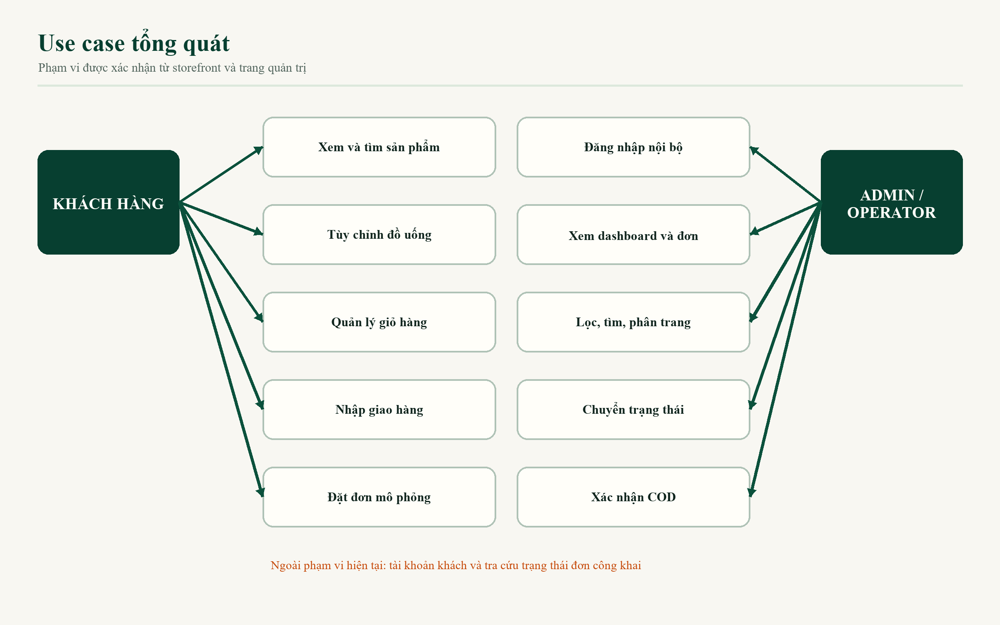

*Hình 3.1. Use case tổng quát của hệ thống*

Hình 3.1 thể hiện hai biên sử dụng. Khách tương tác với storefront và API khách mà không đăng nhập. Quản trị viên hoặc operator đi qua cơ chế xác thực trước khi truy cập trang quản trị. Chức năng tra cứu trạng thái dành cho khách được đặt ngoài vùng triển khai để tránh hiểu nhầm.

## 3.5 Đặc tả use case đặt hàng

| Thuộc tính | Nội dung |
|---|---|
| Tên use case | Đặt đơn trà sữa |
| Tác nhân chính | Khách hàng |
| Tiền điều kiện | Storefront tải được; giỏ có ít nhất một dòng hợp lệ |
| Kích hoạt | Khách chọn “Thanh toán” từ giỏ hàng |
| Luồng chính | Nhập họ tên, số điện thoại, địa chỉ; chọn thanh toán; gửi đơn; backend kiểm tra và tính lại giá; tạo đơn `pending`; khách xác nhận mô phỏng; hệ thống trả mã đơn |
| Luồng thay thế | Geoapify lỗi hoặc không có kết quả thì khách nhập tay; validation sai thì giữ form và chỉ rõ trường lỗi; API tạo đơn lỗi thì giữ dữ liệu để thử lại |
| Hậu điều kiện | Đơn và các dòng hàng được ghi D1; payment là `unpaid` hoặc `simulation_only`; giỏ được xóa sau khi hoàn tất |
| Ngoại lệ | Sản phẩm/topping lạ, số lượng ngoài 1–20, địa chỉ ngắn hoặc phương thức lạ bị từ chối |

## 3.6 Luồng nghiệp vụ đặt hàng

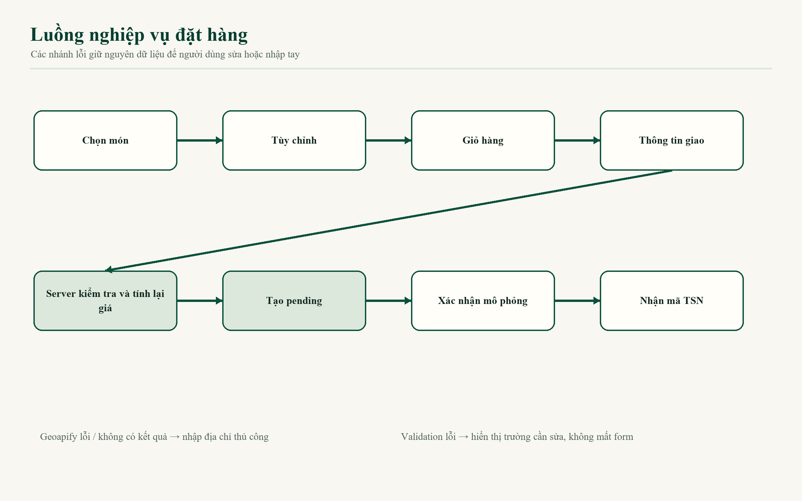

*Hình 3.2. Luồng nghiệp vụ đặt hàng*

Khách có thể quay lại giỏ để sửa số lượng trước khi gửi. Backend tìm sản phẩm trong menu nội bộ, kiểm tra tùy chọn và tính lại giá thay vì tin `unitPrice` của client. Xác nhận của khách chỉ đổi đơn `pending` thành `confirmed`; QR vẫn `simulation_only` và COD vẫn `unpaid`.

## 3.7 Quy tắc nghiệp vụ đã kiểm chứng

| Mã | Quy tắc |
|---|---|
| BR01 | Size M không phụ phí, size L cộng 7.000 đồng đối với đồ uống |
| BR02 | Phí giao hàng mẫu cố định là 18.000 đồng |
| BR03 | Đơn phải có từ 1 đến 50 dòng; số lượng mỗi dòng từ 1 đến 20 |
| BR04 | Họ tên tối thiểu 2 ký tự; địa chỉ tối thiểu 10 ký tự |
| BR05 | Số điện thoại phải khớp mẫu số di động Việt Nam bắt đầu `0` hoặc `+84` |
| BR06 | Sản phẩm và topping phải tồn tại trong dữ liệu nội bộ |
| BR07 | Server tính lại đơn giá và tổng tiền; không tin giá do client gửi |
| BR08 | Sản phẩm topping bán riêng được chuẩn hóa size M, đường 0%, không đá |
| BR09 | Đơn mới có trạng thái `pending`; khách chỉ xác nhận đơn đang chờ |
| BR10 | QR mô phỏng không bao giờ tự chuyển thành `paid` |
| BR11 | COD chỉ được xác nhận đã thu khi đơn `delivering` hoặc `completed` |
| BR12 | Chỉ role `admin` được chuyển trạng thái hoặc xác nhận COD |
| BR13 | Hủy hoặc từ chối cần lý do từ 5 đến 300 ký tự |
| BR14 | Cập nhật trạng thái dùng `expectedVersion`; version cũ nhận lỗi 409 |

---

# CHƯƠNG 4 – PHÂN TÍCH VÀ THIẾT KẾ HỆ THỐNG

## 4.1 Kiến trúc tổng thể

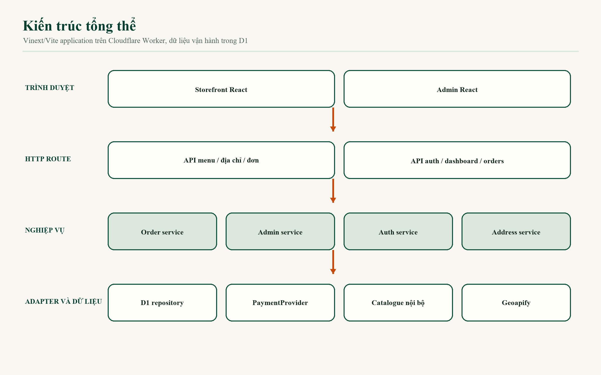

*Hình 4.1. Kiến trúc tổng thể*

Trình duyệt tải storefront hoặc admin từ Worker. Storefront gọi các API menu, địa chỉ và đơn hàng. Admin gọi API auth, dashboard và order operation. Các route chuyển nghiệp vụ sang service. Order service lấy catalogue nội bộ, payment provider và repository. Admin service truy cập D1, còn address service gọi Geoapify qua server. Cấu trúc giữ Geoapify key ngoài bundle và giữ D1 làm nguồn dữ liệu vận hành.

## 4.2 Module, interface và seam

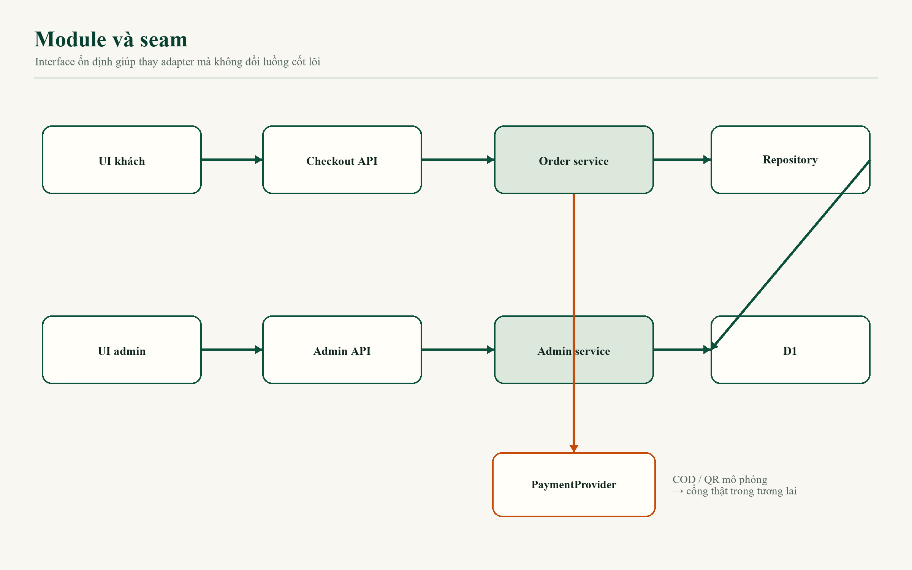

*Hình 4.2. Sơ đồ module và các seam chính*

| Module | Interface hoặc seam | Trách nhiệm |
|---|---|---|
| Storefront UI | `CheckoutApi` và props callback | Hiển thị, state, validation UI, điều hướng trong trang |
| Catalogue | `products`, `toppings`, `pricing` | Nguồn menu và giá nội bộ |
| Address service | `fetchAddressSuggestions` | Gọi Geoapify, chuẩn hóa tối đa 5 kết quả |
| Order service | `createPendingOrder`, `confirmSimulatedOrder` | Validate, tính giá, tạo mã và trạng thái |
| Order repository | `OrderRepository` | Tách lưu trữ khỏi nghiệp vụ |
| D1 adapter | `D1OrderRepository` | Ghi/đọc đơn bằng D1 |
| Payment | `PaymentProvider` | Chuẩn bị và xác nhận luồng COD/QR mô phỏng |
| Admin auth | `requireAdminRequest` | Phiên, role, CSRF, origin |
| Admin orders | Query và command function | Dashboard, danh sách, detail, transition, COD, audit |
| Runtime env | Binding accessor | Cung cấp D1 và biến môi trường cho service |

`PaymentProvider` là seam quan trọng cho hướng mở rộng VNPay, MoMo hoặc ZaloPay. Một provider thật có thể chuẩn bị giao dịch và xử lý callback riêng mà không thay toàn bộ luồng tạo đơn. Tuy nhiên, trước khi tích hợp cần thiết kế idempotency, chữ ký, webhook, đối soát và trạng thái thanh toán bất đồng bộ.

## 4.3 Luồng dữ liệu

Dữ liệu sản phẩm đi từ `app/data/products.ts` tới giao diện và endpoint menu. Khi khách tùy chỉnh món, frontend tạo `CartItem` có khóa ghép từ sản phẩm và các lựa chọn. `storage.ts` lưu mảng giỏ bằng JSON. Khi checkout, client gửi thông tin khách và item IDs tới `/api/orders`.

Backend cắt độ dài chuỗi, kiểm tra điện thoại, địa chỉ, sản phẩm, size, đường, đá, topping và số lượng. Giá được tính lại từ catalogue. Repository ghi transaction gồm order, items, toppings, payment và trạng thái ban đầu. Admin đọc chính dữ liệu D1 này. Mọi mutation quản trị hợp lệ tạo history và audit log.

## 4.4 Sequence quy trình đặt hàng

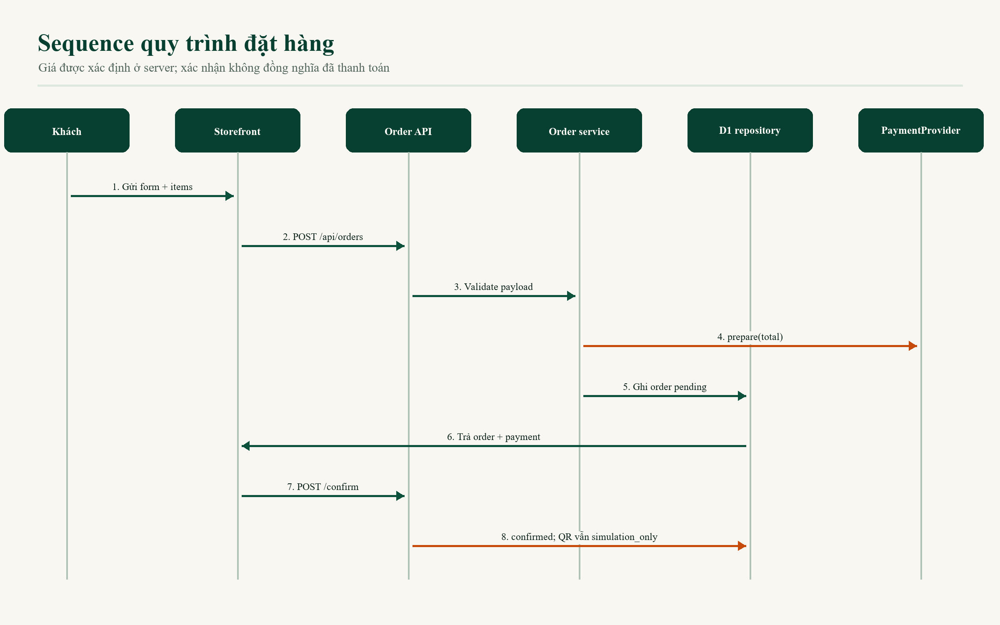

*Hình 4.3. Sequence quy trình đặt hàng*

Sequence trong Hình 4.3 phân biệt rõ hai lần gọi. Lần đầu tạo đơn `pending` sau validation và tính giá. Lần thứ hai xác nhận mô phỏng để đổi order thành `confirmed`. Việc tách bước giúp giao diện có thể hiển thị hướng dẫn thanh toán trước khi hoàn tất xác nhận. Nó không đồng nghĩa với tiền đã được thu.

## 4.5 Thiết kế database và ERD

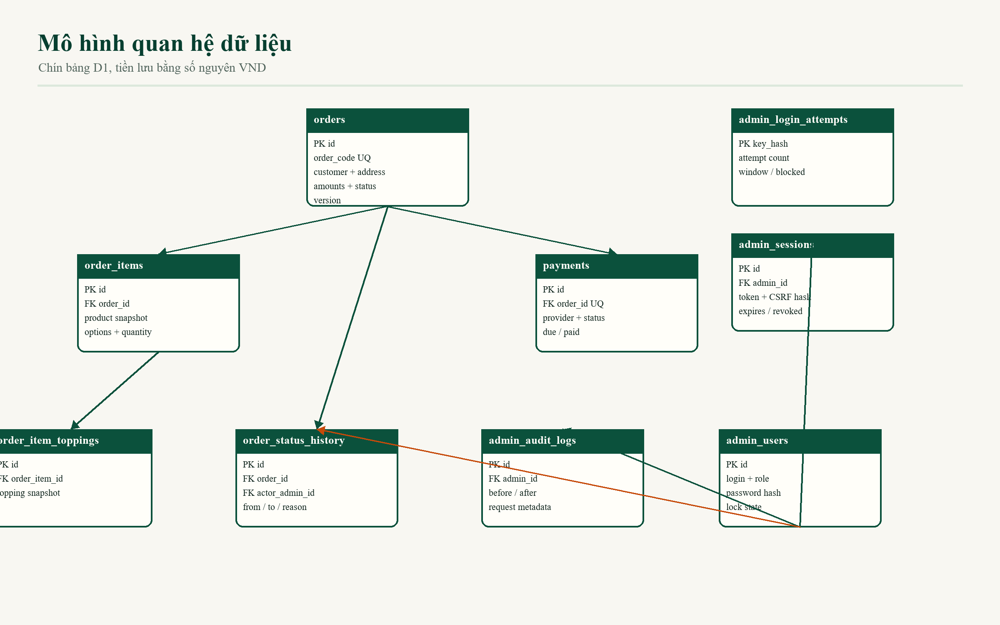

*Hình 4.4. Mô hình quan hệ dữ liệu D1*

| Bảng | Khóa chính | Khóa ngoại chính | Mục đích |
|---|---|---|---|
| `orders` | `id` | Không | Thông tin khách, tiền, trạng thái, version |
| `order_items` | `id` | `order_id → orders.id` | Snapshot từng dòng sản phẩm |
| `order_item_toppings` | `id` | `order_item_id → order_items.id` | Snapshot topping của dòng |
| `payments` | `id` | `order_id → orders.id` | Phương thức, provider, số tiền và trạng thái |
| `admin_users` | `id` | Không | Tài khoản, role, hash và khóa tạm |
| `admin_sessions` | `id` | `admin_id → admin_users.id` | Hash token, CSRF và hạn phiên |
| `admin_login_attempts` | `key_hash` | Không | Đếm thử đăng nhập theo fingerprint |
| `order_status_history` | `id` | `order_id`, `actor_admin_id` | Lịch sử chuyển trạng thái |
| `admin_audit_logs` | `id` | `admin_id` | Nhật ký trước/sau cho mutation |

Schema có unique index cho `order_code`, một payment trên mỗi order, tên đăng nhập và token hash. Các index hỗ trợ lọc trạng thái theo ngày, tìm theo điện thoại, session hết hạn và truy vấn audit. Migration `drizzle/0000_material_maestro.sql` tạo các bảng; repository không có seed dữ liệu. Tài khoản admin local được tạo qua script tương tác.

## 4.6 State machine đơn hàng

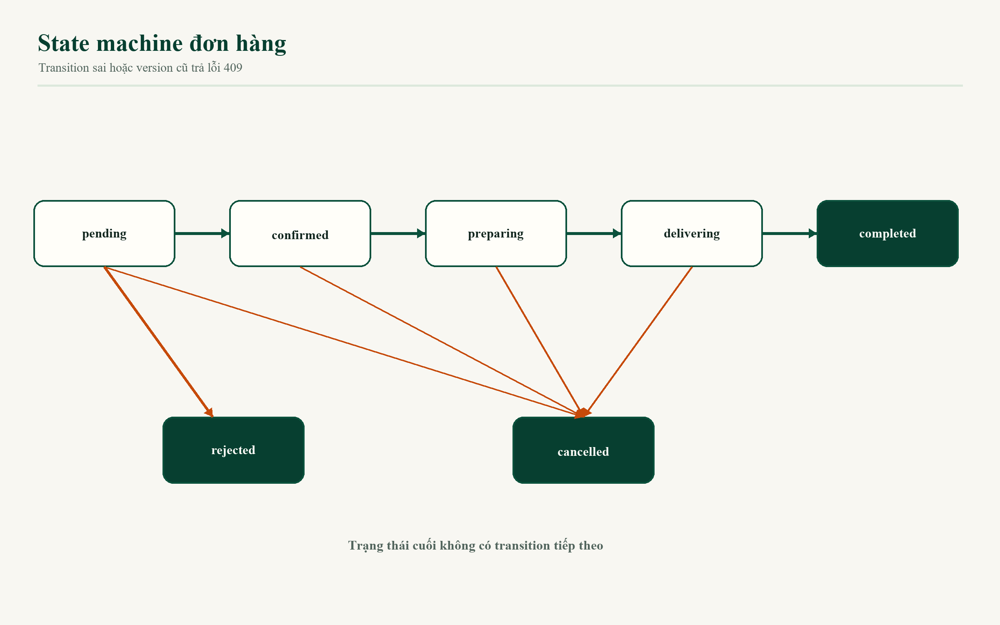

*Hình 4.5. State machine xử lý đơn*

Luồng chuẩn là `pending → confirmed → preparing → delivering → completed`. `pending` có thể chuyển sang `cancelled` hoặc `rejected`; các trạng thái `confirmed`, `preparing`, `delivering` có thể chuyển sang `cancelled`. Ba trạng thái `completed`, `cancelled` và `rejected` là trạng thái cuối. API trả lỗi 409 nếu transition không hợp lệ hoặc `expectedVersion` cũ.

## 4.7 Thiết kế API

| Phương thức và đường dẫn | Người dùng | Chức năng | Bảo vệ chính |
|---|---|---|---|
| `GET /api/menu` | Công khai | Trả catalogue/pricing nội bộ | Chỉ đọc |
| `GET /api/address-suggestions?q=` | Công khai | Proxy Geoapify | Query ≥ 3, timeout, che lỗi/key |
| `POST /api/orders` | Công khai | Tạo đơn pending | Validate và tính lại giá |
| `POST /api/orders/:id/confirm` | Công khai | Xác nhận mô phỏng | Chỉ order pending |
| `POST /api/admin/auth/login` | Admin | Tạo phiên | Rate limit, PBKDF2, lỗi chung |
| `POST /api/admin/auth/logout` | Admin | Thu hồi phiên | Session hiện tại |
| `GET /api/admin/auth/session` | Admin | Đọc principal | Cookie session |
| `GET /api/admin/dashboard` | Admin/operator | Số liệu tổng quan | Session, no-store |
| `GET /api/admin/orders` | Admin/operator | Tìm/lọc/sort/page | Query giới hạn, session |
| `GET /api/admin/orders/:id` | Admin/operator | Chi tiết/history/audit | Session |
| `PATCH /api/admin/orders/:id/status` | Admin | Chuyển trạng thái | Origin, CSRF, role, version |
| `POST /api/admin/orders/:id/payments/cod-confirmation` | Admin | Xác nhận COD | Origin, CSRF, role, điều kiện nghiệp vụ |

Response lỗi dùng cấu trúc JSON có mã, thông báo và field errors khi phù hợp. Route quản trị đặt `cache-control: no-store`; Worker bổ sung `referrer-policy: no-referrer`, `x-content-type-options: nosniff` và `x-frame-options: DENY` cho đường dẫn admin.

## 4.8 Cấu trúc thư mục

Source chính nằm ở `app/`. `app/components` và `app/admin/components` là lớp UI. `app/api` là biên HTTP. `app/server` chứa nghiệp vụ, xác thực, repository và payment provider. `app/data` chứa catalogue/pricing; `app/lib` chứa adapter phía client. `db/schema.ts` định nghĩa dữ liệu, `drizzle/` chứa migration, `worker/index.ts` là entry Cloudflare Worker, còn `tests/` chứa integration test.

Repository cũng có thư mục `deliverables/github-ready` là các gói bàn giao tách storefront/admin. Đây không phải source runtime chính và không được dùng làm bằng chứng duy nhất khi phân tích. Thư mục `examples/d1` thuộc starter, không tham gia nghiệp vụ “Trà Sữa Ngon”.

## 4.9 Thiết kế giao diện và design system

Design system đặt tên “Quầy Trà Ngọc Thủ Công”. Nền dùng giấy ngà lạnh `#f8f7f2`, bề mặt kem `#fffef9`, jade đậm `#073f30`/`#0b513c`, chữ `#10251e` và CTA cam `#c64a0a`. Cam chỉ dùng cho hành động quyết định; jade đảm nhiệm cấu trúc và trạng thái chọn. Thiết kế tránh gradient tím, glassmorphism, shadow nặng và dãy ba card giống nhau.

Typography giao diện dùng font display tự host với Trebuchet MS dự phòng; body dùng Trebuchet MS/Segoe UI. Control chạm có chiều cao 44–60 px, input tối thiểu 52 px. Radius được dùng theo họ: 10 px cho field, 16 px cho surface và pill cho button/chip. Focus sử dụng outline cam 3 px có offset.

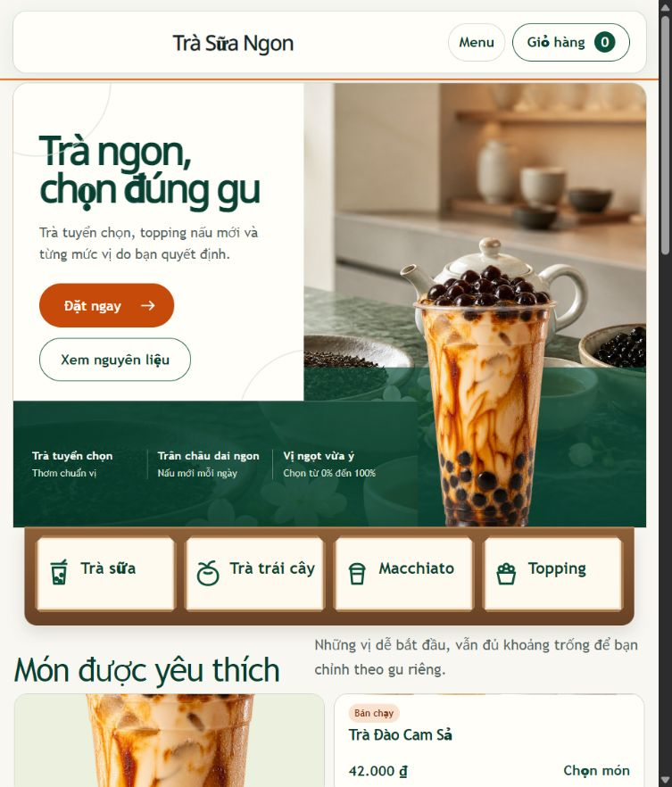

*Hình 4.6. Giao diện cửa hàng ở kích thước 768 px*

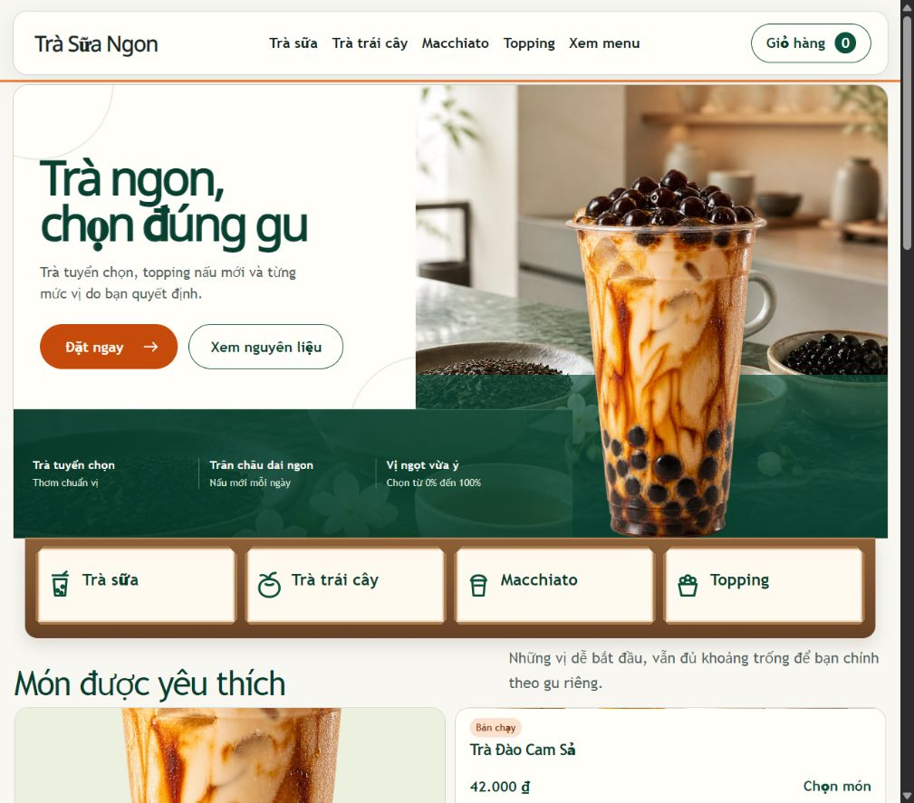

*Hình 4.7. Giao diện cửa hàng ở kích thước 1024 px*

Hai ảnh minh họa cho thấy hero, danh mục và CTA giữ thứ bậc trên tablet. Ở chiều rộng nhỏ hơn, menu desktop được thay bằng điều khiển gọn, nội dung chuyển một cột và chip lọc có thể cuộn ngang. Ảnh được lấy từ thư mục kiểm thử giao diện của chính dự án, không chứa dữ liệu cá nhân.

---

# CHƯƠNG 5 – XÂY DỰNG HỆ THỐNG

## 5.1 Thiết lập môi trường

Dự án yêu cầu Node.js từ 22.13.0. Quy trình local gồm `npm ci`, `npm run db:migrate:local` và `npm run dev`. `package-lock.json` cố định dependency. Vinext cung cấp App Router, Vite chạy dev/build, Cloudflare plugin mô phỏng Worker và D1. Cấu hình dev bind `0.0.0.0` để thiết bị trong cùng LAN có thể truy cập.

`.env.example` khai báo `GEOAPIFY_API_KEY=` và `SITE_URL=http://localhost:3000`. Người phát triển tạo `.env.local` và không commit file này. D1 binding tên `DB` lấy từ `.openai/hosting.json`; `wrangler.jsonc` vẫn dùng database ID placeholder, cho thấy production chưa sẵn sàng.

## 5.2 Xây dựng giao diện khách hàng

`app/page.tsx` hiển thị `TeaShop`. Component này quản lý sáu view: `home`, `menu`, `product`, `cart`, `checkout`, `success`. Đây là điều hướng trong state chứ chưa phải các route URL riêng cho từng trang khách hàng. Header và footer xuất hiện nhất quán; menu mobile có nhãn truy cập; nút giỏ hiển thị số lượng bằng `aria-label`.

Trang chủ có hero, CTA “Đặt ngay”, bốn nhóm danh mục, sản phẩm nổi bật, lợi ích, câu chuyện thương hiệu và footer. Catalogue có loading skeleton 420 ms để biểu diễn trạng thái tải, tìm kiếm, lọc, sắp xếp và empty state. Product view dùng `fieldset` cho các nhóm lựa chọn bắt buộc, hiển thị validation summary và đưa focus tới lỗi khi thiếu lựa chọn.

## 5.3 Dữ liệu và hình ảnh sản phẩm

| Nhóm dữ liệu | Số lượng hoặc giá trị |
|---|---|
| Sản phẩm | 12 mục, gồm 9 đồ uống và 3 topping bán riêng |
| Topping tùy chọn | 5 loại |
| Danh mục | Trà sữa, trà trái cây, macchiato, topping |
| Giá sản phẩm | 7.000–46.000 đồng; đồ uống 38.000–46.000 đồng |
| Phụ phí size L | 7.000 đồng |
| Phí giao hàng mẫu | 18.000 đồng |
| Tag | “Bán chạy”, “Mới” |

Catalogue là dữ liệu TypeScript nội bộ, không lấy từ FakeStoreAPI hoặc Open Food Facts. Hình ảnh trong `public/images` được tạo cho thương hiệu hư cấu; prompt được lưu trong tệp JSON cạnh ảnh. Báo cáo không xem những hình này là bằng chứng về nguyên liệu hoặc chất lượng thực tế.

## 5.4 Giỏ hàng và tính giá

Mỗi `CartItem` lưu `productId`, size, đường, đá, topping, số lượng và đơn giá hiển thị. Khóa dòng được ghép từ các lựa chọn nên hai cấu hình khác nhau không bị gộp. Nếu khóa trùng, thao tác thêm tăng số lượng. Giỏ có thể tăng, giảm hoặc xóa dòng; khi số lượng giảm dưới 1, dòng bị loại bỏ.

Đoạn mã sau thể hiện quy tắc giá cơ bản:

```ts
export const sizeSurcharge = { M: 0, L: 7000 };
export const deliveryFee = 18000;
```

Ở backend, đơn giá được tính lại thay vì tin `unitPrice` của client:

```ts
const unitPrice = product.price
  + sizeSurcharge[size]
  + selectedToppings.reduce((sum, item) => sum + item.price, 0);
```

Cơ chế này ngăn việc sửa payload để giảm giá. Đối với topping bán riêng, service bỏ phụ phí size và không nhận topping lồng nhau.

## 5.5 Form giao hàng và Geoapify

Form có họ tên, điện thoại, địa chỉ, ghi chú và payment. Sau khi người dùng nhập ít nhất ba ký tự địa chỉ, frontend đợi 350 ms rồi gọi API nội bộ; request trước được hủy bằng `AbortController` nếu query thay đổi. State địa chỉ gồm `idle`, `loading`, `ready`, `empty`, `error`. Người dùng luôn có thể nhập tay.

Backend dựng URL Geoapify như sau:

```ts
url.searchParams.set("filter", "countrycode:vn");
url.searchParams.set("limit", "5");
url.searchParams.set("lang", "vi");
```

Dịch vụ đặt timeout mặc định 6.000 ms, giới hạn query 160 ký tự, loại kết quả trùng và chỉ trả năm trường cần thiết. Geoapify mô tả Address Autocomplete là API gợi ý địa chỉ trong quá trình nhập [7]. Trong dự án, API key chỉ được đọc ở server và không xuất hiện trong bundle frontend.

## 5.6 Quy trình đặt hàng và thanh toán mô phỏng

`createPendingOrder` làm sạch dữ liệu khách, kiểm tra trường, chuẩn hóa items, tính subtotal, cộng 18.000 đồng giao hàng và tạo mã `TSN` dựa trên thời gian cùng đoạn UUID. Order mới có `status: pending`, `version: 1` và payment instruction từ provider.

`PaymentProvider` định nghĩa hai thao tác `prepare` và `confirmSimulation`. COD tạo payment `unpaid`, `amountPaid: 0`. QR tạo `simulation_only`, reference dạng `MOCK-<orderId>` và thông báo rõ không có giao dịch. Khi khách xác nhận, provider QR vẫn giữ `simulation_only`; không có đoạn mã nào tự đổi QR thành `paid`.

## 5.7 Backend, repository và database

Route handler chỉ đọc request, gọi service và chuyển lỗi thành response. Nghiệp vụ order không tự tạo kết nối database; nó gọi `getOrderRepository()`. Resolver dùng D1 theo mặc định và chỉ dùng memory khi `ORDER_STORAGE=memory` được bật rõ cho test cô lập. Cách thiết kế này giúp test service mà không làm mất vị trí source of truth của D1.

D1 repository ghi một đơn cùng item, topping, payment và history trong transaction. Dữ liệu tên/giá được snapshot. Admin query dùng SQL server-side để tìm kiếm, lọc payment/status/ngày, sắp xếp và phân trang. Page size được giới hạn từ 1 đến 100, mặc định 20.

## 5.8 Website admin

Trang admin có bốn page: `/admin/login`, `/admin`, `/admin/orders`, `/admin/orders/:id`. Login form gửi thông tin tới API; session hợp lệ mới vào admin shell. Dashboard hiển thị tổng đơn, đơn mới, đang xử lý, hoàn tất, hủy, tổng giá trị, đã thu, còn phải thu, số COD và QR mô phỏng.

Danh sách đơn hỗ trợ query, status, payment status, payment method, khoảng ngày, sort và phân trang. Trang chi tiết hiển thị thông tin khách, dòng hàng, tiền, payment, history và audit. Cập nhật trạng thái yêu cầu version hiện tại. Khi version xung đột, server trả 409 để giao diện tải lại thay vì ghi đè âm thầm.

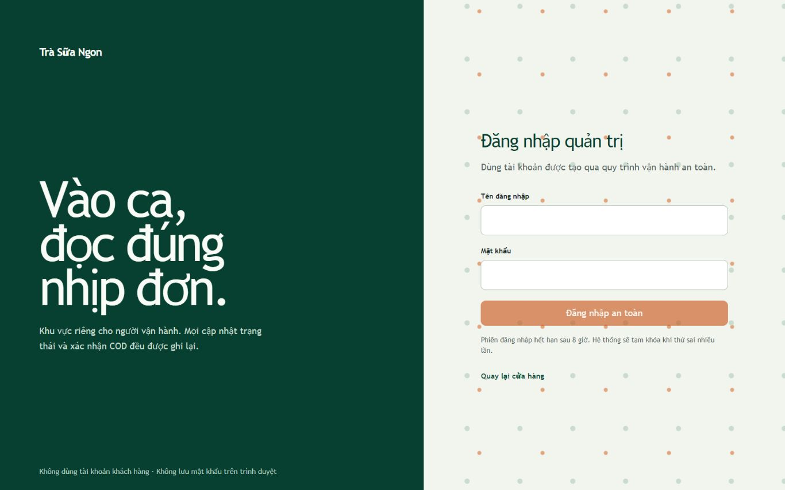

*Hình 5.1. Trang đăng nhập admin trên desktop*

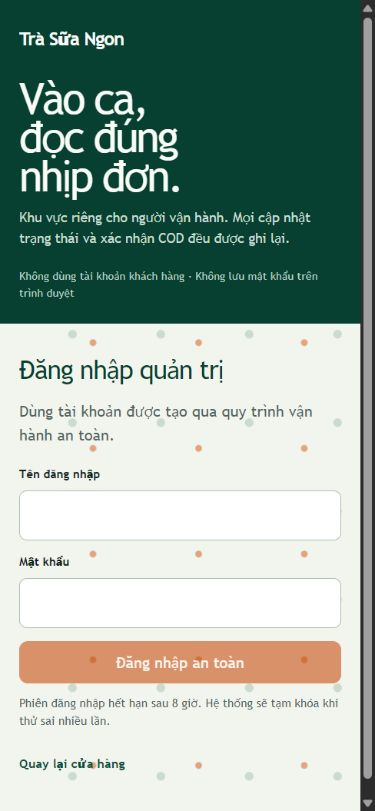

*Hình 5.2. Trang đăng nhập admin trên điện thoại*

Ảnh cho thấy login form giữ nhãn, CTA và cảnh báo nội bộ trên hai kích thước. Dashboard, danh sách và detail chưa được chụp bằng phiên admin thật trong báo cáo kiểm thử vì không có mật khẩu/session được cung cấp cho bước browser QA. Chức năng này đã được kiểm tra qua HTTP và D1 integration test.

## 5.9 Validation và xử lý lỗi

Frontend kiểm tra các lựa chọn bắt buộc trước khi thêm giỏ và kiểm tra họ tên, điện thoại, địa chỉ trước submit. Backend lặp lại validation với giới hạn độ dài. Đây là cách phòng thủ cần thiết vì validation client có thể bị bỏ qua.

Thông báo lỗi không làm mất dữ liệu form. Address service chuyển lỗi key, mạng và response thành thông báo thân thiện. API admin không trả stack trace. Login dùng thông báo chung. Các trang admin và API admin đều đặt no-store để tránh cache dữ liệu nhạy cảm.

## 5.10 Cấu hình local, LAN và production

Development chạy ở `http://localhost:3000`. Khi cùng Wi-Fi, Vite in địa chỉ `Network`, ví dụ `http://192.168.x.x:3000`; điện thoại phải dùng IP của máy thay vì `localhost`. Windows Firewall cần cho phép Node.js trên mạng Private. Cách này chỉ dùng kiểm thử LAN, không mở cổng router và không thay thế hosting.

Production được định hướng Cloudflare Workers và D1. Tuy nhiên, database ID trong config vẫn là placeholder, chưa có D1 remote, secret production, tên Worker chính thức hoặc DNS/HTTPS đã xác minh. Trạng thái đúng là **Chưa triển khai production**.

---

# CHƯƠNG 6 – KIỂM THỬ VÀ ĐÁNH GIÁ

## 6.1 Mục tiêu và nguyên tắc kiểm thử

Kiểm thử tập trung vào những rủi ro ảnh hưởng trực tiếp tới đơn hàng: nội dung storefront, dữ liệu menu, gợi ý địa chỉ, giá server, payment state, authentication, authorization, state transition, COD, responsive và secret exposure. Integration test đi qua Worker HTTP hoặc interface công khai; D1 test dùng database tạm của Miniflare, không truy cập production.

Báo cáo này không chạy lại build/test vì phạm vi công việc chỉ cho phép ghi vào `docs`. Kết quả dưới đây được trích từ `docs/ADMIN_TEST_REPORT.md` ngày 30/08/2026 và `docs/RESPONSIVE_TEST_REPORT.md` ngày 24/08/2026, sau đó đối chiếu với `tests/rendered-html.test.mjs`. Các trường hợp không có bằng chứng chạy được ghi “Chưa kiểm tra trực tiếp”.

## 6.2 Môi trường kiểm thử đã ghi nhận

- Hệ điều hành: Windows.
- Runtime dự án: Node.js theo yêu cầu `>=22.13.0`.
- Browser UI: Chromium tích hợp của Codex.
- Database integration: D1 tạm qua Cloudflare/Miniflare.
- Storefront responsive: 16 viewport từ 320 × 568 đến 1920 × 1080.
- Admin login: 390 × 844, 768 × 1024, 1366 × 900 và 1920 × 1080.
- Firefox, Safari, Edge và Chrome độc lập: chưa kiểm tra trực tiếp.

## 6.3 Unit test

Repository không có bộ unit test riêng cho từng hàm. Node test runner hiện chạy 11 integration test sau khi build. Một số hàm được kiểm tra gián tiếp qua HTTP, gồm pricing, Geoapify adapter, order service, auth và admin state transition. Do đó, báo cáo không ghi “unit test đạt”; đây là khoảng trống cần bổ sung.

## 6.4 Integration/API test

Test dựng application Worker và gửi request vào các endpoint. Geoapify được stub nên không dùng API key thật hoặc mạng thật. D1 test tạo dữ liệu admin/đơn trong database tạm. Bộ test xác minh địa chỉ Việt Nam, giới hạn năm kết quả, lỗi key/mạng, server pricing, payment state, login/rate limit, search, transition, COD và audit.

## 6.5 Kiểm thử giao diện và responsive

Theo báo cáo responsive, 16 viewport không có tràn ngang và không ghi nhận control hiển thị dưới 44 px. Luồng mobile menu, product customization, cart, checkout, success và reset cart đã được đi qua trên Chromium. Trường hợp mẫu chọn sản phẩm `p1`, size L, đường 50%, ít đá và trân châu trắng có đơn giá 54.000 đồng; cộng 18.000 đồng giao hàng thành 72.000 đồng. Đây là dữ liệu test mẫu, không phải giao dịch thật.

Trang đăng nhập admin được kiểm tra ở bốn kích thước. Dashboard/list/detail sau đăng nhập chưa được mở trực tiếp do không có credential/session cho browser QA, nhưng API tương ứng có integration test. Console được ghi nhận sạch sau lần reload cuối ở các luồng đã chụp.

## 6.6 Bảng kết quả kiểm thử

| Test ID | Chức năng | Điều kiện | Các bước | Kết quả mong đợi | Kết quả thực tế | Trạng thái |
|---|---|---|---|---|---|---|
| T01 | Render storefront | Build local | GET trang gốc | 200, có thương hiệu/menu/asset | Đúng theo test 1 | Đạt |
| T02 | SEO canonical | SITE_URL test | GET robots và sitemap | URL cùng cấu hình | Đúng theo test 2 | Đạt |
| T03 | Menu nội bộ | Worker test | GET `/api/menu` | Catalogue/pricing nội bộ | Đúng theo test 3 | Đạt |
| T04 | Query địa chỉ ngắn | Thiếu/short query | Gọi endpoint | Validation hoặc danh sách rỗng an toàn | Đúng theo test 4 | Đạt |
| T05 | Địa chỉ Việt Nam | Geoapify stub | Query hợp lệ | `countrycode:vn`, tối đa 5, trường tối giản | Đúng theo test 5 | Đạt |
| T06 | Geoapify empty/lỗi | Stub empty, 401/500 | Gọi endpoint | Không lộ key, báo lỗi thân thiện | Đúng theo test 6 | Đạt |
| T07 | Tạo và xác nhận đơn | Item hợp lệ | POST create, confirm | Server tính giá; QR không paid | Đúng theo test 7 | Đạt |
| T08 | Validation order | Thiếu địa chỉ hoặc item/payment lạ | POST create | 400 và field error | Đúng theo test 8 | Đạt |
| T09 | Secret scan | Build đã tạo | Quét source/bundle | Không có key thật; `.env` được bảo vệ | Đúng theo test 9 | Đạt |
| T10 | Admin auth/rate limit | D1 tạm | Login đúng/sai lặp lại | Session hợp lệ; khóa tạm khi vượt ngưỡng | Đúng theo test 10 | Đạt |
| T11 | Admin order operation | Admin session | Search, transition, COD, audit | Quy tắc, version và audit đúng | Đúng theo test 11 | Đạt |
| T12 | Lint | Source ngày 30/08/2026 | `npm run lint` | Exit code 0 | Báo cáo ghi pass | Đạt theo báo cáo |
| T13 | Type check | Source ngày 30/08/2026 | `npm run typecheck` | Exit code 0 | Báo cáo ghi pass | Đạt theo báo cáo |
| T14 | Production build | Source ngày 30/08/2026 | `npm run build` | Build thành công | Báo cáo ghi pass | Đạt theo báo cáo |
| T15 | Storefront responsive | Chromium | 16 viewport | Không overflow, control dùng được | Báo cáo ghi đạt | Đạt theo báo cáo |
| T16 | Admin login responsive | Chromium | 4 viewport | Form/CTA không tràn | Báo cáo ghi đạt | Đạt theo báo cáo |
| T17 | Firefox/Safari/Edge | Browser tương ứng | Chạy luồng chính | Không lỗi tương thích | Chưa có runtime/bằng chứng | Chưa kiểm tra |
| T18 | Unit test cô lập | Unit suite | Chạy từng module | Có kết quả độc lập | Chưa có suite | Chưa triển khai |
| T19 | Production smoke | Worker/D1 thật | Deploy và chạy smoke | Hostname, DB, secret hoạt động | Chưa deploy | Chưa kiểm tra |

## 6.7 Đánh giá kết quả kiểm thử

Bộ test hiện bao phủ các luồng có rủi ro cao hơn một demo giao diện thuần túy: backend tính lại giá, Geoapify lỗi, key thiếu, payload lạ, QR không paid, auth rate limit, state conflict và audit. Đây là ưu điểm đáng kể vì các lỗi này khó phát hiện bằng cách chỉ nhấp giao diện.

Hạn chế chính là chưa có unit test, chưa có end-to-end automation trên nhiều browser, chưa đo performance production và chưa kiểm tra database remote. Việc browser QA admin không có phiên đăng nhập thật cũng để lại khoảng trống trực quan cho dashboard, list và detail. Trước khi phát hành, nhóm cần bổ sung credential test an toàn và chạy regression trên Firefox, Safari hoặc WebKit, Edge và Chrome độc lập.

---

# CHƯƠNG 7 – TRIỂN KHAI, BẢO MẬT VÀ VẬN HÀNH

## 7.1 Chạy local

Các lệnh chuẩn được ghi trong README:

```bash
npm ci
npm run db:migrate:local
npm run dev
```

Sau khi migrate, quản trị viên local được tạo bằng `npm run admin:create`. Script yêu cầu mật khẩu từ 12 đến 200 ký tự, ẩn khi nhập và chỉ ghi hash. Nó từ chối chế độ remote. Người dùng mở storefront ở `http://localhost:3000` và admin ở `/admin/login`.

## 7.2 Truy cập trong LAN

`vite.config.ts` đặt `host: "0.0.0.0"`. Điện thoại hoặc tablet cùng Wi-Fi dùng địa chỉ IPv4 của máy tính và port 3000. `localhost` trên điện thoại trỏ về chính điện thoại nên không thể dùng. Máy tính cần cho Node.js qua Windows Firewall ở profile Private; router phải không bật guest/client isolation. Development server không được mở ra Internet.

## 7.3 Nền tảng production dự kiến

Cloudflare Workers là nền tảng production được lựa chọn trong cấu trúc hiện tại; D1 lưu dữ liệu và Workers xử lý route/API [4][5]. Vinext build ESM Worker, `worker/index.ts` kết nối app router và image optimization. `SITE_URL` cung cấp canonical URL cho metadata, robots và sitemap.

Tuy nhiên, `wrangler.jsonc` còn database ID placeholder, tên miền trong tài liệu chỉ là giá trị dự kiến và chưa có kết quả DNS/HTTPS. Vì vậy, trạng thái chính thức là **Chưa triển khai production**. Báo cáo không khẳng định `trasuangon.com` đã sở hữu hoặc hoạt động.

## 7.4 Biến môi trường và binding

| Tên | Môi trường | Mục đích | Ghi chú bảo mật |
|---|---|---|---|
| `GEOAPIFY_API_KEY` | Server | Gọi Address Autocomplete | Không prefix public, không đưa bundle/log |
| `SITE_URL` | Server/build | Canonical URL | Local dùng localhost; production dùng host thật |
| `ORDER_STORAGE` | Test/local có chủ đích | Chọn memory adapter | Mặc định không đặt để dùng D1 |
| `DB` | Cloudflare binding | Truy cập D1 | Binding, không phải connection string client |
| `IMAGES`, `ASSETS` | Worker binding | Tối ưu và phục vụ asset | Do Cloudflare runtime cung cấp |

## 7.5 Bảo vệ dữ liệu người dùng

Order service cắt giới hạn độ dài để giảm payload bất thường. Admin API dùng no-store và không trả stack trace. Dữ liệu audit lưu network fingerprint đã băm thay vì IP thô. Source không có analytics hoặc tracking bên thứ ba ngoài request Geoapify khi người dùng nhập địa chỉ.

Hệ thống vẫn lưu họ tên, số điện thoại và địa chỉ trong D1 vì cần giao hàng. Trước production, nhóm cần xác định thời gian lưu, quyền truy cập, quy trình xóa, backup, thông báo riêng tư và cách xử lý yêu cầu của người dùng. Các chính sách này **Cần bổ sung**.

## 7.6 Bảo mật trang admin

Login dùng PBKDF2-SHA256 310.000 vòng với salt ngẫu nhiên. So sánh digest dùng hàm constant-time; user lạ vẫn chạy dummy password work. Hệ thống giới hạn năm lần thử trong 15 phút rồi chặn 15 phút. Session tồn tại tám giờ; raw token không lưu trong database.

Cookie session có `HttpOnly`, giúp JavaScript client không đọc được token. Cookie CSRF không HttpOnly để admin client gửi lại qua header. Cả hai `SameSite=Lax`, và `Secure` bật khi HTTPS. Request mutation yêu cầu same-origin, CSRF token và role admin. Các biện pháp này phù hợp với hướng dẫn OWASP về authentication và CSRF [8][9], nhưng chưa thay thế security review độc lập.

## 7.7 Phân quyền và tính toàn vẹn nghiệp vụ

Role `operator` chỉ đọc; role `admin` mới được chuyển trạng thái hoặc xác nhận COD. State machine ngăn bỏ qua giai đoạn không hợp lệ. Optimistic version giảm nguy cơ hai nhân viên ghi đè cùng một đơn. History và audit ghi diễn biến trước/sau, người thao tác và request ID.

Server pricing bảo vệ tính toàn vẹn tiền. Payment provider giữ `amountDue`, `amountPaid`, `paidAt` và status riêng. COD chỉ chuyển `paid` sau thao tác nội bộ được phép; QR mô phỏng không được đánh dấu paid. Không có số tài khoản hoặc mã QR ngân hàng thật trong source.

## 7.8 Sao lưu, phục hồi và giám sát

Repository chưa có script backup/restore, lịch backup D1, cảnh báo runtime hoặc dashboard giám sát production. Đây là phần **Chưa được triển khai**. Trước triển khai thật, nhóm cần xác định RPO/RTO, tần suất backup, cách thử phục hồi, log retention và cảnh báo khi order API hoặc Geoapify lỗi.

## 7.9 Hạn chế triển khai hiện tại

- Chưa tạo D1 production và chưa chạy migration remote.
- Chưa tạo tài khoản admin production theo quy trình phê duyệt.
- Chưa cấu hình secret production.
- Chưa xác minh hostname, DNS, TLS hoặc redirect canonical.
- Chưa có backup/restore và giám sát.
- Chưa chạy smoke test sau deploy.
- Chưa kiểm tra nhiều trình duyệt và thiết bị vật lý.
- Chưa có phân tách môi trường staging rõ trong config runtime.

---

# CHƯƠNG 8 – KẾT QUẢ VÀ ĐÁNH GIÁ

## 8.1 Chức năng đã hoàn thành

Storefront đã có đầy đủ luồng cốt lõi từ trang chủ tới thành công. Người dùng xem 12 sản phẩm, tìm kiếm, lọc, sắp xếp, tùy chỉnh đồ uống, quản lý giỏ, nhập giao hàng và đặt đơn. Địa chỉ có autocomplete phía server và nhập tay dự phòng. Hai lựa chọn thanh toán đều mô tả đúng bản chất mô phỏng.

Backend có internal catalogue, server pricing, validation, order repository và D1 schema. Admin có auth, role, dashboard, list/detail, state machine, COD confirmation, history và audit. Các interface repository/payment giữ khả năng thay adapter trong tương lai.

## 8.2 Chức năng chưa hoàn thành

Khách chưa có tài khoản và trang theo dõi trạng thái đơn. Không có tồn kho, voucher, quản lý sản phẩm trong admin, thông báo, nhiều chi nhánh hoặc thống kê doanh thu theo kỳ đầy đủ. QR không phải cổng thanh toán. Production, backup, monitoring và policy dữ liệu chưa được thiết lập.

## 8.3 Mức độ đáp ứng mục tiêu

| Mục tiêu | Đánh giá | Nhận xét |
|---|---|---|
| Duyệt và tìm món | Đáp ứng | Catalogue, search, filter, sort và empty state có trong UI |
| Tùy chỉnh và tính giá | Đáp ứng | Size/đường/đá/topping; client hiển thị và server tính lại |
| Giỏ hàng bền vững | Đáp ứng trong thiết bị | `localStorage`, chưa đồng bộ tài khoản |
| Đặt đơn mô phỏng | Đáp ứng | D1, pending/confirmed, mã đơn |
| Thanh toán an toàn | Đáp ứng phạm vi mô phỏng | COD unpaid, QR simulation_only |
| Quản trị đơn | Đáp ứng | Auth, role, dashboard, transition, COD, audit |
| Responsive và accessibility | Đáp ứng một phần đã kiểm chứng | Chromium nhiều viewport; browser khác chưa kiểm tra |
| Sẵn sàng production | Chưa đáp ứng | D1/secret/DNS/TLS/smoke chưa cấu hình |

## 8.4 Ưu điểm

Ưu điểm kỹ thuật quan trọng nhất là dữ liệu tiền không phụ thuộc client. Menu và pricing nằm nội bộ; service từ chối ID lạ và tính lại tổng. Payment state thể hiện rõ sự khác nhau giữa chưa thanh toán, mô phỏng và đã thu COD. Admin mutation có CSRF, role, transition và optimistic version thay vì chỉ dựa vào việc ẩn nút.

Về UX, giao diện có hệ thống màu, spacing và component riêng, không dùng template ba card lặp lại. Trạng thái loading, empty, error và validation có nội dung tiếng Việt cụ thể. Layout đã được đo trên nhiều viewport, menu mobile và touch target được quan tâm.

## 8.5 Hạn chế

`TeaShop.tsx` chứa nhiều view và logic trong một file lớn. Storefront chuyển trang bằng state nên không có URL chia sẻ cho sản phẩm, giỏ hay checkout. Catalogue vẫn là file TypeScript; admin chưa quản lý sản phẩm; customer ID chưa gắn với bảng hoặc cơ chế xác thực khách.

Kiểm thử chưa có unit suite, browser automation đa nền tảng hoặc performance benchmark. Browser QA admin mới dừng ở login. Production chưa tồn tại nên chưa thể đánh giá độ trễ D1, quota Geoapify và tải thực tế.

## 8.6 Khó khăn và bài học kinh nghiệm

Khó khăn chính là giữ ranh giới giữa mô phỏng và vận hành thật. Dự án dùng message, provider và payment status để QR không bị hiểu là giao dịch thật. Từ đó, nhóm rút ra rằng trạng thái nghiệp vụ phải được lưu trong dữ liệu.

Client phục vụ tương tác; server kiểm tra dữ liệu và tính tiền. State machine, version và audit giúp thao tác admin có thể truy vết. Responsive cũng cần kiểm tra control, focus, lỗi và bàn phím điện thoại, không chỉ breakpoint.

## 8.7 Khả năng áp dụng thực tế

Sản phẩm có thể dùng làm prototype, bài tập học phần hoặc nền tảng thử nghiệm cho cửa hàng nhỏ. Để sử dụng thương mại thật, nhóm phải bổ sung quản lý sản phẩm, tồn kho, chính sách dữ liệu, theo dõi đơn, thông báo, cổng thanh toán, quan sát hệ thống, backup và quy trình vận hành. Tên miền, nội dung pháp lý, thông tin liên hệ và hình ảnh thương hiệu cũng cần được xác minh.

---

# KẾT LUẬN VÀ HƯỚNG PHÁT TRIỂN

Đề tài đã xây dựng được một website thương mại điện tử trà sữa có luồng mua hàng và luồng quản trị tương đối hoàn chỉnh trong môi trường local. Source thể hiện rõ catalogue nội bộ, cấu hình đồ uống, giỏ hàng, checkout, proxy địa chỉ, D1 repository, payment provider, authentication, role và state machine. Các quyết định như server pricing, QR `simulation_only`, CSRF, session hash và audit log giúp demo có nền tảng kỹ thuật tốt hơn một giao diện tĩnh.

Giá trị chính của dự án là khả năng nối trải nghiệm mua hàng với dữ liệu vận hành mà vẫn giữ giới hạn mô phỏng minh bạch. Kết quả kiểm thử hiện có cho thấy build và 11 integration test đã đạt theo báo cáo ngày 30/08/2026; storefront responsive đã được kiểm tra rộng trên Chromium. Dù vậy, dự án chưa sẵn sàng mở công khai vì chưa có D1 production, secret, DNS/TLS, backup, monitoring và kiểm thử đa trình duyệt.

Các hướng phát triển được đề xuất theo thứ tự ưu tiên:

1. Tách storefront thành route sản phẩm, giỏ, checkout và tra cứu đơn; thêm mã truy cập ngắn để khách theo dõi trạng thái mà không lộ dữ liệu.
2. Xây dựng quản lý catalogue, tồn kho và giá trong admin; bổ sung migration và audit tương ứng.
3. Bổ sung khuyến mãi với quy tắc có thời hạn, điều kiện áp dụng và server-side calculation.
4. Hoàn thiện phân quyền chi tiết hơn role `admin`/`operator`, ví dụ quyền xem PII, xử lý đơn và đối soát.
5. Mở rộng dashboard thành thống kê doanh thu theo ngày, phương thức, trạng thái và sản phẩm; phân biệt doanh số đơn với tiền thực thu.
6. Tích hợp thông báo đơn qua kênh được phê duyệt và có consent.
7. Thêm adapter VNPay, MoMo hoặc ZaloPay với chữ ký, idempotency, webhook, timeout, retry và đối soát; không đánh dấu paid từ redirect client.
8. Thiết lập staging, D1 production, secret, custom domain, TLS, backup, monitoring và runbook sự cố.
9. Bổ sung unit test, end-to-end test đa trình duyệt, accessibility audit thủ công và đo Core Web Vitals production.

---

# TÀI LIỆU THAM KHẢO

Tài liệu được trình bày theo thứ tự xuất hiện. Ngày truy cập: 07/09/2026.

[1] Meta Open Source, “React Quick Start”, React Documentation. https://react.dev/learn

[2] Microsoft, “The TypeScript Handbook”, TypeScript Documentation. https://www.typescriptlang.org/docs/handbook/intro.html

[3] Vite Team, “Getting Started”, Vite Documentation. https://vite.dev/guide/

[4] Cloudflare, “Cloudflare Workers Documentation”. https://developers.cloudflare.com/workers/

[5] Cloudflare, “Cloudflare D1 Documentation”. https://developers.cloudflare.com/d1/

[6] Drizzle Team, “Drizzle ORM Overview”. https://orm.drizzle.team/docs/overview

[7] Geoapify, “Address Autocomplete API”, Developer Documentation. https://apidocs.geoapify.com/docs/geocoding/address-autocomplete/

[8] OWASP Foundation, “Authentication Cheat Sheet”. https://cheatsheetseries.owasp.org/cheatsheets/Authentication_Cheat_Sheet.html

[9] OWASP Foundation, “Cross-Site Request Forgery Prevention Cheat Sheet”. https://cheatsheetseries.owasp.org/cheatsheets/Cross-Site_Request_Forgery_Prevention_Cheat_Sheet.html

[10] Mozilla, “Responsive Web Design”, MDN Web Docs. https://developer.mozilla.org/en-US/docs/Learn_web_development/Core/CSS_layout/Responsive_Design

[11] Nhóm dự án, `README.md`, `PRODUCT.md`, `DESIGN.md`, source TypeScript và tài liệu trong `docs/` của dự án “Trà Sữa Ngon”, bản khảo sát tại `D:\TMDT`, 07/09/2026.

---

# PHỤ LỤC A – CẤU TRÚC THƯ MỤC

```text
TMDT/
├── app/
│   ├── admin/                 # Page và component quản trị
│   ├── api/                   # API khách và API admin
│   ├── components/TeaShop.tsx # Storefront
│   ├── data/                  # Catalogue và pricing
│   ├── lib/                   # Client API và localStorage
│   ├── server/                # Service, auth, repository, payment
│   ├── globals.css
│   ├── layout.tsx
│   └── page.tsx
├── db/                        # Drizzle schema và D1 accessor
├── drizzle/                   # SQL migration và metadata
├── public/                    # Font, favicon, ảnh sản phẩm/social
├── scripts/                   # Migrate local và tạo admin
├── tests/                     # 11 integration test
├── worker/                    # Cloudflare Worker entry
├── docs/                      # Tài liệu kỹ thuật và báo cáo
├── .openai/hosting.json       # Binding D1 của Sites starter
├── package.json
├── package-lock.json
├── vite.config.ts
├── wrangler.jsonc
├── PRODUCT.md
├── DESIGN.md
└── README.md
```

`CONTEXT.md` không tồn tại tại thời điểm khảo sát. `examples/d1` là ví dụ của starter. `deliverables/github-ready` là gói bàn giao và không phải cây source runtime chính.

---

# PHỤ LỤC B – HỢP ĐỒNG API TÓM TẮT

## B.1 Tạo đơn

```http
POST /api/orders
Content-Type: application/json

{
  "customer": {
    "fullName": "Khách hàng mẫu",
    "phone": "0900000000",
    "address": "Địa chỉ mẫu tại Việt Nam",
    "note": "",
    "payment": "cash"
  },
  "items": [{
    "productId": "p1",
    "size": "L",
    "sugar": "50%",
    "ice": "Ít đá",
    "toppings": ["white-pearl"],
    "quantity": 1
  }]
}
```

Backend trả `order` có ID, trạng thái, item đã chuẩn hóa, subtotal, delivery fee, total và payment instruction. Số điện thoại, địa chỉ trên đây chỉ là dữ liệu minh họa; không dùng để giao hàng.

## B.2 Chuyển trạng thái admin

```http
PATCH /api/admin/orders/:id/status
Content-Type: application/json
X-CSRF-Token: <token của phiên>

{
  "toStatus": "preparing",
  "expectedVersion": 2,
  "reason": ""
}
```

API yêu cầu session hợp lệ, same-origin, CSRF và role admin. Version cũ hoặc transition sai trả HTTP 409.

---

# PHỤ LỤC C – DANH SÁCH TEST CASE

1. Render storefront, metadata, asset và nội dung thương hiệu.
2. Kiểm tra canonical URL trong robots và sitemap.
3. Kiểm tra menu/pricing từ dữ liệu nội bộ.
4. Kiểm tra query địa chỉ ngắn và thiếu Geoapify key.
5. Kiểm tra filter Việt Nam, giới hạn năm kết quả và response tối giản.
6. Kiểm tra empty, network error, key bị từ chối và dữ liệu upstream sai.
7. Tạo đơn, tính giá, snapshot và xác nhận không tự paid.
8. Từ chối thiếu địa chỉ, sản phẩm lạ và payment lạ.
9. Quét secret trong frontend bundle và xác minh `.env` được bảo vệ.
10. Kiểm tra login admin, cookie/session và rate limit.
11. Kiểm tra search/filter/page, state transition, version conflict, COD và audit.

Chi tiết điều kiện, dữ liệu và kết quả nằm trong `tests/rendered-html.test.mjs`, `docs/TEST_PLAN.md`, `docs/ADMIN_TEST_REPORT.md` và `docs/RESPONSIVE_TEST_REPORT.md`.

---

# PHỤ LỤC D – HƯỚNG DẪN CÀI ĐẶT

1. Cài Node.js 22.13.0 trở lên.
2. Mở terminal tại thư mục dự án.
3. Chạy `npm ci` để cài đúng lockfile.
4. Sao chép `.env.example` thành `.env.local`.
5. Điền `GEOAPIFY_API_KEY` nếu muốn dùng autocomplete; không commit giá trị thật.
6. Giữ `SITE_URL=http://localhost:3000` khi phát triển local.
7. Chạy `npm run db:migrate:local`.
8. Chạy `npm run admin:create` nếu cần tài khoản quản trị local.
9. Chạy `npm run dev` và mở URL terminal cung cấp.
10. Trước khi bàn giao, chạy `npm run lint`, `npm run typecheck`, `npm test` và kiểm tra browser thủ công.

Production cần quy trình riêng để tạo D1 remote, áp dụng migration, đặt secret, tạo admin, deploy Worker, cấu hình domain/TLS và chạy smoke test. Các bước này chưa thực hiện trong dự án hiện tại.

---

# PHỤ LỤC E – BẢNG PHÂN CÔNG THÀNH VIÊN

| STT | Họ và tên | MSSV | Nhiệm vụ | Tỷ lệ đóng góp | Chữ ký |
|---|---|---|---|---|---|
| 1 | [CẦN BỔ SUNG] | [CẦN BỔ SUNG] | [CẦN BỔ SUNG] | [CẦN BỔ SUNG] | |
| 2 | [CẦN BỔ SUNG] | [CẦN BỔ SUNG] | [CẦN BỔ SUNG] | [CẦN BỔ SUNG] | |
| 3 | [CẦN BỔ SUNG] | [CẦN BỔ SUNG] | [CẦN BỔ SUNG] | [CẦN BỔ SUNG] | |
| 4 | [CẦN BỔ SUNG] | [CẦN BỔ SUNG] | [CẦN BỔ SUNG] | [CẦN BỔ SUNG] | |

Số dòng được điều chỉnh theo số thành viên thực tế. Nhóm cần thống nhất nhiệm vụ và tỷ lệ đóng góp trước khi nộp.
